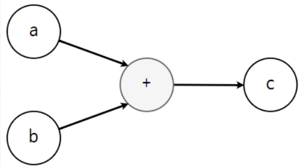
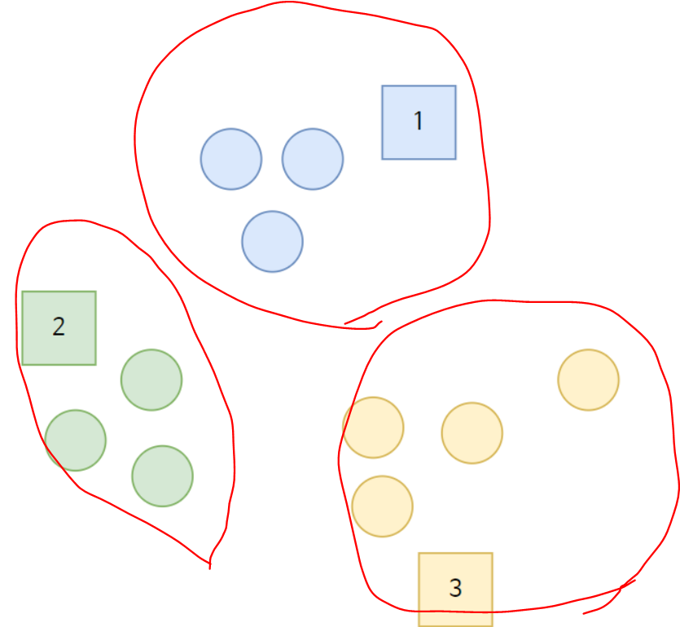
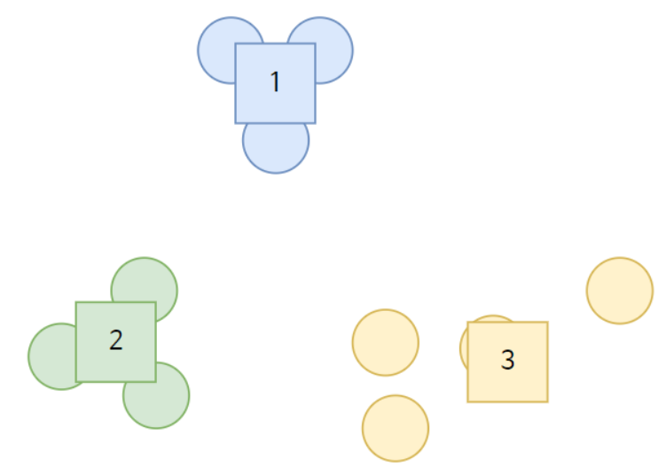
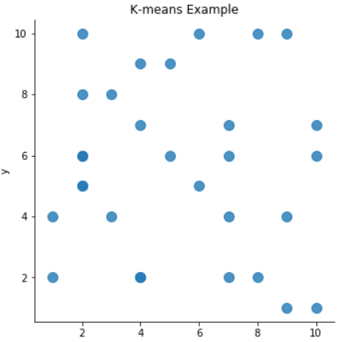
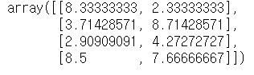
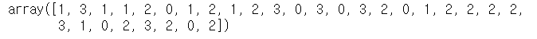
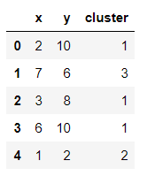
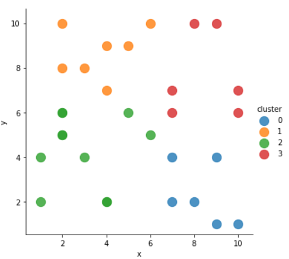

# 텐서플로&머신러닝 기초

##### 2019-12-26

## 1. 변수 와 상수

### 상수 - constant()

변하지 않는 수, ( )안에 넣은것으로 지정됨

````python
import tensorflow as tf
a = tf.constant(1) #상수
b = tf.constant(2)
c = tf.add(a,b) # 더하기 함수
sess = tf.Session() #세션생성
sess.run(c)
````


### 변수 - Variable()

변경될 수 있는 값

변수를 바꿀 때 global_variables_initializer() 를 통해서 변수를 초기화 해서 계산.

````python
import tensorflow as tf
a=tf.Variable(5) #변수지정
b=tf.Variable(3)
c=tf.multiply(a,b) #곱하기 함수
init = tf.global_variables_initializer() # 변수 초기화
sess = tf.Session() #세션생성
sess.run(init) 
sess.run(c)

a=tf.Variable(15)
c=tf.multiply(a,b)
init = tf.global_variables_initializer()
sess.run(init)
sess.run(c)
````


## 2. 플레이스 홀더(Placeholder)

- 다른 텐서를 할당하기위해 사용
- 학습데이터를 포함하는 변수, 어떤 데이터를 학습시킬지.


위의 경우 입력 x가 플레이스 홀더

````python
tf.placeholder(dtype, shape, name)
#dtype : 플레이스 홀더에 저장되는 자료형
#shape : 배열의 차원
#name : 플레이스 홀더의 이름
#shape 나 name은 반드시 정의하지 않아도 됨.
````

이후 Feeding을 이용해서 플레이스 홀더를 학습데이터로 설정할 수 있음.

````python
##프레이스 홀더 실습1
input = [1,2,3,4,5]
x = tf.placeholder(dtype = tf.float32)
y = x + 5
sess = tf.Session()
sess.run(y, feed_dict={x:input})

##프레이스 홀더 실습2
mathscore = [85,99,84,97,92]
engscore = [59,60,80,65,94]
a=tf.placeholder(dtype=tf.float32)
b=tf.placeholder(dtype=tf.float32)
y=(a+b)/2
sess = tf.Session()
sess.run(y, feed_dict={a:mathscore, b:engscore})
````

## 3. 주요함수들

- tf.add() - 덧셈
- tf.subtract() - 뺄셈
- tf.multiply() - 곱셈
- tf.truediv() - 나눗셈의 몫
- tf.mod() - 나눗셈의 나머지
- tf.abs() - 절대값
- tf.negative() - 음수 반환
- tf.sign() - 음수양수 판단.
- tf.square() - 제곱 수행
- tf.pow() - 거듭제곱 수행
- tf.maximum() - 더큰값 반환
- tf.minimum() - 더 작은 값 반환 
- tf.exp() - 지수값 계산
- tf.log() - 로그값 계산

## 4. 아키텍처(Architecture)

크로스 플랫폼 라이브러리,  플랫폼에 국한되지 않고, 다양한 언어로 사용할 수 있음


#### 1.클라이언트

> C++, Python

컴퓨터 연산과정을 데이터 플로우 그래프 형태로 표현

session을 통해 자신이 만든 그래프를 실행 할 수 있음

#### 2.분산된 마스터

부분그래프를 정리 , 직접처리X 

업무들을 분할하고 작업자 서비스에게 분배 

실행 할 그래프 조각을 초기화

#### 3.작업자 서비스

그래프 작업의 실행을 관리.

다른작업자 서비스와 실행 결과를 주고 받음

#### 4.커널 기능

개별적인 그래프 작업을 처리.

실질적으로 연산을 처리하는 부분


클라이언트에서 작성된그래프 -> Master에서 Worker에게 분배

## 5. 텐서플로 세션

> 텐서플로에서 데이터의 처리단위는 텐서(tensor)이다. 
>
> 일종의 다차원 배열의 객체

````python
import tensorflow as tf
a=tf.constant(17.5)
b=tf.constant(5.0)
c = tf.add(a,b)
print(c)
#Tensor("Add:0", shape=(), dtype=float32)
````




tf.constant()와 tf.add()를 이용해서 수행한 명령어는 위와같은 그래프를 정의한것이고, 명령을 수행하는 것은 아님

`연산을 수행하기 위해서는 a,b에 데이터를 넣어 흐름(flow)이 이루어지게 만들어야 하는`데 이 동작이 **세션(Session)**이다


> Session은 실제 값을 대입한 그래프가 동작하도록 하는 역할.
>
> 위의 식을 실행시키기 위해서는 tf.Session()을 사용해야한다. 

````python
import tensorflow as tf
a=tf.constant(17.5)
b=tf.constant(5.0)
c=tf.add(a,b)
sess = tf.Session()
sess.run(c)
#22.5
````

## 6.빅 데이터, K-평균(K-Means)

> k-means : 비지도 학습 알고리즘

#### 1. 사전준비

- 클러스터링을 수행할 데이터의 주제결정
- 얼마나 많은 클러스터를 만들지 고민
- 데이터준비
- 클러스터링을 수행하기 위한 방법 선택

#### 2. K-means 수행과정

1. 중심(centroid)에 가까운 데이터를 클러스터에 포함
2. 중심(centroid)을 클러스터의 중앙으로 이동

두과정을 반복수행 -> 완전하게 군집화된 클러스터들을 얻을 수 있음 

더이상 중심의 위치가 변하지 않을 때 까지 반복하는 것이 일반적

#### 3. 무작위 중심값 선택 알고리즘

데이터를 각 클러스터중에 가장 가까운 클러스터(거리)에 속하도록 배정해주는 것



이후  더 완벽한 클러스터링을 위해 중심의 위치를 데이터의 중간으로 이동시키게됨



이작업을 분류가 완벽하게 될 때 까지 진행함

# 7. 빅 데이터 K 평균(K-Means) 구현하기

````python
from sklearn.cluster import KMeans
import numpy as np
import pandas as pd
import seaborn as sns
import matplotlib.pyplot as plt
%matplotlib inline
````

필요한 패키지들을 임포트

````python
df = pd.DataFrame(columns=['x','y'])
import random
for i in range(30):
    df.loc[i] = [random.randint(1,10),random.randint(1,10)]
````

x,y의 컬럼이 1~10까지의 랜덤 정수를 가지는 dataframe을 만듬

#### 데이터 시각화

````python
sns.lmplot('x','y', data=df, fit_reg=False, scatter_kws={'s':100})
plt.title('K-means Example')
plt.xlabel('x')
plt.ylabel('y')
````



#### K-means를 활용한 클러스터링

````python
points = df.values 
#데이터프레임을 넘파이 객체로 초기화
kmeans = KMeans(n_cluster=4).fit(points)
#데이터를 기반으로 K-means 알고리즘을 수행해 클러스터4개를 생성 
kmeans.cluster_centers_
#각 클러스터들의 중심위치를 구함
````



````python
kmeans.labels_
#각 데이터가 속한 클러스터를 확인
````



````python
df['cluster'] = kmeans.labels_
#df에 cluster컬럼을 추가
df.head()
````



````python
sns.lmplot('x','y', data=df, fit_reg=False, scatter_kws={'s':150}, hue='cluster')
#cluster를 
````

