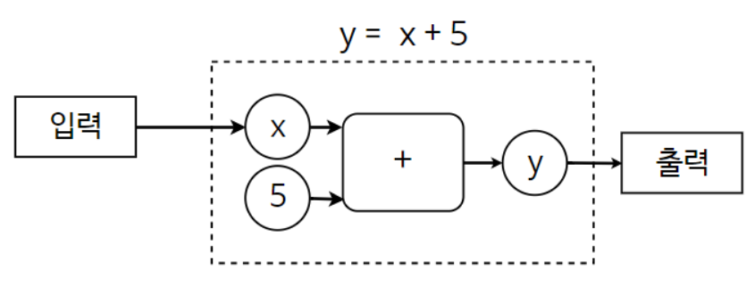
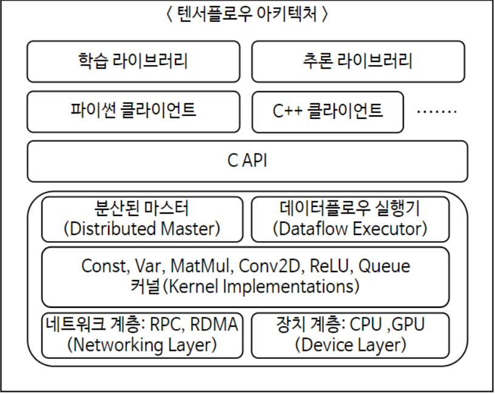
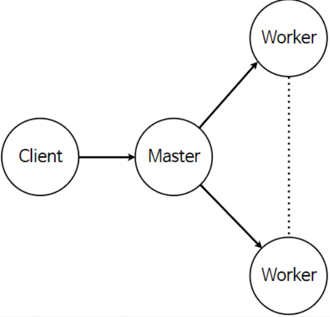

# 텐서플로&머신러닝 기초

##### 2019-12-26

## 1. 변수 와 상수

### 상수 - constant()

변하지 않는 수, ( )안에 넣은것으로 지정됨

````python
import tensorflow as tf
a = tf.constant(1) #상수
b = tf.constant(2)
c = tf.add(a,b) # 더하기 함수
sess = tf.Session() #세션생성
sess.run(c)
````


### 변수 - Variable()

변경될 수 있는 값

변수를 바꿀 때 global_variables_initializer() 를 통해서 변수를 초기화 해서 계산.

````python
import tensorflow as tf
a=tf.Variable(5) #변수지정
b=tf.Variable(3)
c=tf.multiply(a,b) #곱하기 함수
init = tf.global_variables_initializer() # 변수 초기화
sess = tf.Session() #세션생성
sess.run(init) 
sess.run(c)

a=tf.Variable(15)
c=tf.multiply(a,b)
init = tf.global_variables_initializer()
sess.run(init)
sess.run(c)
````


## 2. 플레이스 홀더(Placeholder)

- 다른 텐서를 할당하기위해 사용
- 학습데이터를 포함하는 변수, 어떤 데이터를 학습시킬지.



위의 경우 입력 x가 플레이스 홀더

````python
tf.placeholder(dtype, shape, name)
#dtype : 플레이스 홀더에 저장되는 자료형
#shape : 배열의 차원
#name : 플레이스 홀더의 이름
#shape 나 name은 반드시 정의하지 않아도 됨.
````

이후 Feeding을 이용해서 플레이스 홀더를 학습데이터로 설정할 수 있음.

````python
##프레이스 홀더 실습1
input = [1,2,3,4,5]
x = tf.placeholder(dtype = tf.float32)
y = x + 5
sess = tf.Session()
sess.run(y, feed_dict={x:input})

##프레이스 홀더 실습2
mathscore = [85,99,84,97,92]
engscore = [59,60,80,65,94]
a=tf.placeholder(dtype=tf.float32)
b=tf.placeholder(dtype=tf.float32)
y=(a+b)/2
sess = tf.Session()
sess.run(y, feed_dict={a:mathscore, b:engscore})
````

## 3. 주요함수들

- tf.add() - 덧셈
- tf.subtract() - 뺄셈
- tf.multiply() - 곱셈
- tf.truediv() - 나눗셈의 몫
- tf.mod() - 나눗셈의 나머지
- tf.abs() - 절대값
- tf.negative() - 음수 반환
- tf.sign() - 음수양수 판단.
- tf.square() - 제곱 수행
- tf.pow() - 거듭제곱 수행
- tf.maximum() - 더큰값 반환
- tf.minimum() - 더 작은 값 반환 
- tf.exp() - 지수값 계산
- tf.log() - 로그값 계산

## 4. 아키텍처(Architecture)

크로스 플랫폼 라이브러리,  플랫폼에 국한되지 않고, 다양한 언어로 사용할 수 있음



#### 1.클라이언트

> C++, Python

컴퓨터 연산과정을 데이터 플로우 그래프 형태로 표현

session을 통해 자신이 만든 그래프를 실행 할 수 있음

#### 2.분산된 마스터

부분그래프를 정리 , 직접처리X 

업무들을 분할하고 작업자 서비스에게 분배 

실행 할 그래프 조각을 초기화

#### 3.작업자 서비스

그래프 작업의 실행을 관리.

다른작업자 서비스와 실행 결과를 주고 받음

#### 4.커널 기능

개별적인 그래프 작업을 처리.

실질적으로 연산을 처리하는 부분



클라이언트에서 작성된그래프 -> Master에서 Worker에게 분배

